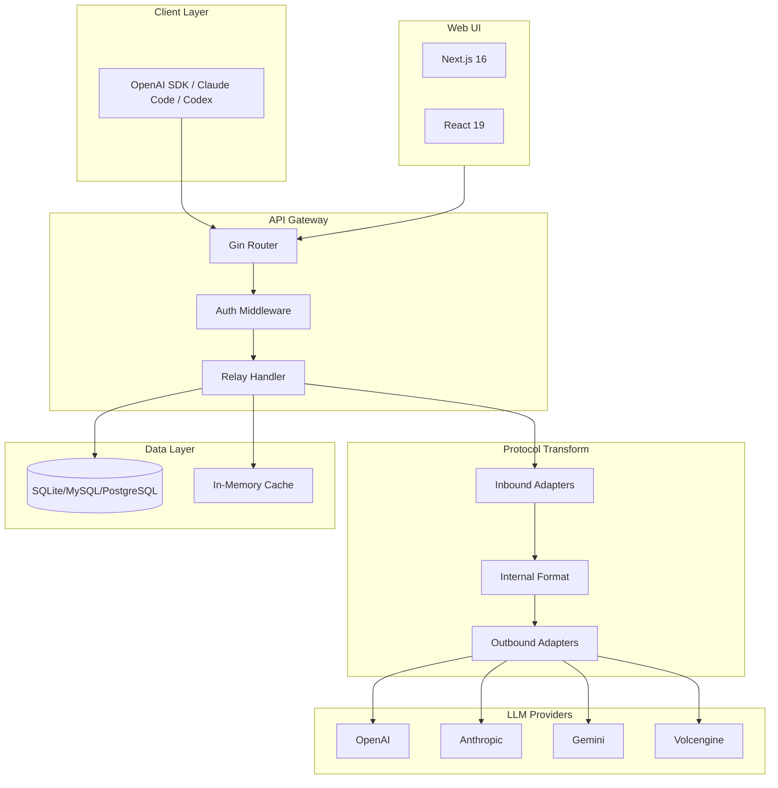

# Octopus - LLM API Aggregation & Load Balancing Service

> Generated: 2026-01-16 13:52:53
> Updated: 2026-01-17 (Added Tauri Desktop App)

## Project Overview

Octopus is a lightweight, elegant LLM API aggregation and load balancing service designed for individuals. It provides unified management of multiple LLM provider channels with smart routing, protocol conversion, and comprehensive analytics.

### Key Features

- Multi-channel aggregation with unified management
- Multi-key support per channel
- Smart endpoint selection (lowest latency)
- Load balancing (Round Robin, Random, Failover, Weighted)
- Protocol conversion (OpenAI Chat/Responses, Anthropic, Gemini)
- Automatic price and model synchronization
- Request statistics and cost tracking
- Multi-database support (SQLite, MySQL, PostgreSQL)
- **Desktop App** with system tray (Tauri v2)

## Architecture



## Module Index

| Module | Path | Description |
|--------|------|-------------|
| **cmd** | `cmd/` | CLI commands (Cobra) |
| **internal** | `internal/` | Core business logic |
| **web** | `web/` | Frontend (Next.js + React) |
| **src-tauri** | `src-tauri/` | Desktop app (Tauri v2 + Rust) |
| **scripts** | `scripts/` | Build scripts |
| **docs** | `docs/` | Documentation |

### Internal Submodules

| Submodule | Path | Description |
|-----------|------|-------------|
| client | `internal/client/` | HTTP client utilities |
| conf | `internal/conf/` | Configuration management |
| db | `internal/db/` | Database connection & migrations |
| helper | `internal/helper/` | Utility functions |
| model | `internal/model/` | Data models (GORM) |
| op | `internal/op/` | Data operations (CRUD) |
| price | `internal/price/` | Model pricing logic |
| relay | `internal/relay/` | Request relay & load balancing |
| server | `internal/server/` | HTTP server (Gin) |
| task | `internal/task/` | Background tasks |
| transformer | `internal/transformer/` | Protocol adapters |
| update | `internal/update/` | Auto-update functionality |
| utils | `internal/utils/` | Common utilities |

## Tech Stack

### Backend (Go 1.24.4)

- **Web Framework**: Gin
- **ORM**: GORM (SQLite, MySQL, PostgreSQL)
- **CLI**: Cobra + Viper
- **Logging**: Zap
- **SSE**: go-sse
- **Tokenizer**: tiktoken-go

### Frontend (Node.js 18+)

- **Framework**: Next.js 16
- **UI Library**: React 19
- **State Management**: Zustand
- **Data Fetching**: TanStack Query
- **Styling**: Tailwind CSS 4
- **UI Components**: Radix UI
- **Animation**: Motion
- **i18n**: next-intl

## Quick Commands

```bash
# Development - Backend
go run main.go start

# Development - Frontend
cd web && pnpm install && NEXT_PUBLIC_API_BASE_URL="http://127.0.0.1:8080" pnpm run dev

# Build Frontend
cd web && pnpm run build

# Production Build
mv web/out static/
go build -o octopus main.go
./octopus start

# Desktop App - Development
npm install && cd web && pnpm install && cd ..
sh scripts/build-go-binaries.sh --dev
npm run tauri:dev

# Desktop App - Production Build
npm run tauri:build
```

## Configuration

Configuration file: `data/config.json`

```json
{
  "server": { "host": "0.0.0.0", "port": 8080 },
  "database": { "type": "sqlite", "path": "data/data.db" },
  "log": { "level": "info" }
}
```

Environment variables: `OCTOPUS_<PATH>` (e.g., `OCTOPUS_SERVER_PORT`)

## API Protocol Support

### Inbound (Client-facing)

| Type | Endpoint |
|------|----------|
| OpenAI Chat | `/v1/chat/completions` |
| OpenAI Responses | `/v1/responses` |
| Anthropic | `/v1/messages` |

### Outbound (Provider-facing)

| Type | Provider |
|------|----------|
| OpenAI Chat | OpenAI, compatible providers |
| OpenAI Responses | OpenAI |
| Anthropic | Anthropic |
| Gemini | Google Gemini |
| Volcengine | ByteDance Volcengine |

## Default Credentials

- **Username**: `admin`
- **Password**: `admin`

## Module Documentation

- [internal/CLAUDE.md](internal/CLAUDE.md) - Backend core modules
- [web/CLAUDE.md](web/CLAUDE.md) - Frontend modules
- [docs/TAURI_FEATURES.md](docs/TAURI_FEATURES.md) - Desktop app features
- [docs/TAURI_BUILD.md](docs/TAURI_BUILD.md) - Desktop app build guide
- [docs/TAURI_CHANGELOG.md](docs/TAURI_CHANGELOG.md) - Desktop app changelog

## Desktop App (Tauri v2)

Octopus can run as a native desktop application with system tray support.

### Architecture

```
┌─────────────────────────────────────────────────────────────┐
│                    Tauri Desktop App                        │
├─────────────────────────────────────────────────────────────┤
│  ┌─────────────┐  ┌─────────────────────────────────────┐  │
│  │ System Tray │  │        WebView Window               │  │
│  │ (Rust)      │  │  ┌─────────────────────────────┐    │  │
│  │ • Status    │  │  │   Next.js Frontend          │    │  │
│  │ • Start     │  │  │   (static export)           │    │  │
│  │ • Stop      │  │  └─────────────────────────────┘    │  │
│  │ • Restart   │  │                                     │  │
│  │ • Logs      │  │                                     │  │
│  │ • Quit      │  │                                     │  │
│  └─────────────┘  └─────────────────────────────────────┘  │
├─────────────────────────────────────────────────────────────┤
│                 Go Backend (sidecar process)                │
│  ┌───────────────────────────────────────────────────────┐  │
│  │              Existing Octopus Core                    │  │
│  └───────────────────────────────────────────────────────┘  │
└─────────────────────────────────────────────────────────────┘
```

### Desktop Features

- **System Tray**: Status indicator, Start/Stop/Restart service, View Logs, Quit
- **Process Management**: Go backend runs as sidecar, auto-starts on launch
- **Log Streaming**: Real-time stdout/stderr from Go backend to frontend
- **Cross-Platform**: macOS, Windows, Linux support

### Desktop Tech Stack

- **Framework**: Tauri v2
- **Language**: Rust
- **Plugins**: tauri-plugin-shell (sidecar management)

### Key Files

| File | Description |
|------|-------------|
| `src-tauri/src/lib.rs` | Process management + system tray |
| `src-tauri/tauri.conf.json` | Tauri configuration |
| `web/src/lib/desktop.ts` | Desktop mode detection |
| `web/src/lib/tauri-events.ts` | Tauri event handling |
| `web/src/components/modules/log/TauriLogViewer.tsx` | Log viewer component |
| `scripts/build-go-binaries.sh` | Go sidecar build script |
