# Internal Module - Backend Core

> [Root](../CLAUDE.md) > internal

## Module Overview

The `internal` package contains all backend business logic for Octopus, organized into focused submodules.

## Architecture

```mermaid
graph LR
    subgraph Entry["Entry Points"]
        CMD[cmd/start.go]
    end

    subgraph Server["HTTP Server"]
        Router[router/]
        Handlers[handlers/]
        Middleware[middleware/]
        Auth[auth/]
    end

    subgraph Core["Core Logic"]
        Relay[relay/]
        Transformer[transformer/]
        Balancer[balancer/]
    end

    subgraph Data["Data Layer"]
        Model[model/]
        Op[op/]
        DB[db/]
        Cache[utils/cache/]
    end

    subgraph Support["Support"]
        Conf[conf/]
        Task[task/]
        Price[price/]
        Helper[helper/]
        Utils[utils/]
    end

    CMD --> Server
    Server --> Core
    Core --> Data
    Core --> Support
    Data --> Support
```



## Submodule Details

### client/ - HTTP Client

HTTP client utilities for outbound requests.

| File | Description |
|------|-------------|
| `http.go` | HTTP client with proxy support |

### conf/ - Configuration

Application configuration and constants.

| File | Description |
|------|-------------|
| `config.go` | Viper-based config loading |
| `const.go` | Application constants |
| `version.go` | Version information |
| `banner.go` | Startup banner |
| `debug.go` | Debug mode settings |

### db/ - Database

Database connection and migrations.

| File | Description |
|------|-------------|
| `db.go` | GORM database initialization |
| `migrate/migrate.go` | Migration runner |
| `migrate/001.go` | Initial schema |
| `migrate/002.go` | Schema updates |

### model/ - Data Models

GORM models for all entities.

| File | Entity | Description |
|------|--------|-------------|
| `channel.go` | Channel, ChannelKey | LLM provider channels |
| `group.go` | Group, GroupItem | Channel groups for routing |
| `apikey.go` | APIKey | Client API keys |
| `user.go` | User | Admin users |
| `log.go` | Log | Request logs |
| `stats.go` | Stats* | Statistics models |
| `setting.go` | Setting | System settings |
| `llm.go` | LLM | Model definitions |
| `backup.go` | Backup | Backup records |

### op/ - Data Operations

CRUD operations with caching.

| File | Description |
|------|-------------|
| `channel.go` | Channel CRUD |
| `group.go` | Group CRUD with model mapping |
| `apikey.go` | API key management |
| `user.go` | User authentication |
| `log.go` | Log recording |
| `stats.go` | Statistics aggregation |
| `setting.go` | Settings management |
| `llm.go` | LLM model operations |
| `cache.go` | Cache management |
| `backup.go` | Backup operations |

### relay/ - Request Relay

Core request forwarding logic.

| File | Description |
|------|-------------|
| `relay.go` | Main relay handler with retry logic |
| `type.go` | Relay context and types |
| `metrics.go` | Request metrics collection |
| `balancer/balancer.go` | Load balancing strategies |

**Load Balancing Modes:**
- Round Robin (0)
- Random (1)
- Failover (2)
- Weighted (3)

### transformer/ - Protocol Adapters

Request/response transformation between protocols.

```
transformer/
├── model/           # Internal format definitions
│   ├── interface.go # Inbound/Outbound interfaces
│   ├── model.go     # InternalLLMRequest/Response
│   └── gemini.go    # Gemini-specific types
├── inbound/         # Client → Internal
│   ├── register.go  # Adapter registry
│   ├── openai/      # OpenAI Chat/Responses
│   └── anthropic/   # Anthropic Messages
└── outbound/        # Internal → Provider
    ├── register.go  # Adapter registry
    ├── openai/      # OpenAI adapters
    ├── authropic/   # Anthropic adapter
    ├── gemini/      # Gemini adapter
    └── volcengine/  # Volcengine adapter
```

**Inbound Types:**
- `InboundTypeOpenAIChat` (0) - OpenAI Chat Completions
- `InboundTypeOpenAIResponse` (1) - OpenAI Responses API
- `InboundTypeAnthropic` (2) - Anthropic Messages

**Outbound Types:**
- `OutboundTypeOpenAIChat` (0)
- `OutboundTypeOpenAIResponse` (1)
- `OutboundTypeAnthropic` (2)
- `OutboundTypeGemini` (3)
- `OutboundTypeVolcengine` (4)

### server/ - HTTP Server

Gin-based HTTP server.

```
server/
├── server.go        # Server initialization
├── router/router.go # Route registration
├── handlers/        # Request handlers
│   ├── relay.go     # API relay endpoints
│   ├── channel.go   # Channel management
│   ├── group.go     # Group management
│   ├── apikey.go    # API key management
│   ├── user.go      # User management
│   ├── log.go       # Log queries
│   ├── stats.go     # Statistics
│   ├── model.go     # Model listing
│   ├── setting.go   # Settings
│   └── update.go    # Auto-update
├── middleware/      # Middleware
│   ├── auth.go      # JWT authentication
│   ├── cors.go      # CORS handling
│   ├── logger.go    # Request logging
│   ├── static.go    # Static file serving
│   └── validate.go  # Request validation
├── auth/auth.go     # JWT utilities
└── resp/            # Response helpers
    ├── resp.go      # Success responses
    └── error.go     # Error responses
```

### task/ - Background Tasks

Scheduled background jobs.

| File | Description |
|------|-------------|
| `init.go` | Task initialization |
| `task.go` | Task runner |
| `sync.go` | Model/price sync |
| `channel.go` | Channel health checks |

### price/ - Pricing

Model pricing logic.

| File | Description |
|------|-------------|
| `price.go` | Price calculation |
| `presets.go` | Default price presets |

### helper/ - Helpers

Utility functions.

| File | Description |
|------|-------------|
| `channel.go` | Channel utilities |
| `delay.go` | Delay measurement |
| `fetch.go` | HTTP fetch helpers |
| `price.go` | Price helpers |

### utils/ - Utilities

Common utilities.

| Submodule | Description |
|-----------|-------------|
| `cache/` | In-memory sharded cache |
| `log/` | Zap logger wrapper |
| `tokenizer/` | Token counting |
| `snowflake/` | ID generation |
| `xstrings/` | String utilities |
| `xslice/` | Slice utilities |
| `xurl/` | URL utilities |
| `diff/` | Diff utilities |
| `shutdown/` | Graceful shutdown |

### update/ - Auto-Update

Application auto-update functionality.

| File | Description |
|------|-------------|
| `update.go` | Update checker |
| `core.go` | Update execution |

## Key Interfaces

### Inbound Interface

```go
type Inbound interface {
    TransformRequest(ctx context.Context, body []byte) (*InternalLLMRequest, error)
    TransformResponse(ctx context.Context, resp *InternalLLMResponse) ([]byte, error)
    TransformStream(ctx context.Context, stream *InternalLLMStream) ([]byte, error)
    GetInternalResponse(ctx context.Context) (*InternalLLMResponse, error)
}
```

### Outbound Interface

```go
type Outbound interface {
    TransformRequest(ctx context.Context, req *InternalLLMRequest, baseURL, key string) (*http.Request, error)
    TransformResponse(ctx context.Context, resp *http.Response) (*InternalLLMResponse, error)
    TransformStream(ctx context.Context, data []byte) (*InternalLLMStream, error)
}
```

## Request Flow

1. Client sends request to `/v1/chat/completions` or `/v1/messages`
2. `middleware/auth.go` validates API key
3. `handlers/relay.go` routes to `relay.Handler()`
4. `relay.go` parses request via inbound adapter
5. `op/group.go` finds matching channel group
6. `balancer/` selects channel based on mode
7. Outbound adapter transforms and sends request
8. Response transformed back through inbound adapter
9. `metrics.go` records statistics
