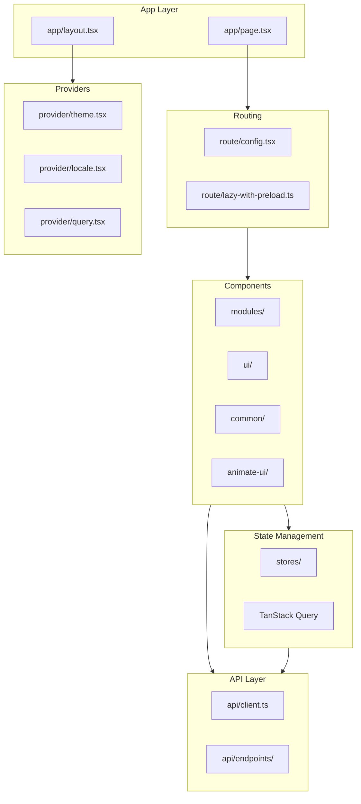

# Web Module - Frontend

> [Root](../CLAUDE.md) > web

## Module Overview

The `web` package is a Next.js 16 application providing the management UI for Octopus. Built with React 19, Tailwind CSS 4, and modern component patterns.

## Tech Stack

- **Framework**: Next.js 16 (App Router, Static Export)
- **UI Library**: React 19 with React Compiler
- **State Management**: Zustand
- **Data Fetching**: TanStack Query v5
- **Styling**: Tailwind CSS 4
- **UI Components**: Radix UI primitives
- **Animation**: Motion (Framer Motion)
- **i18n**: next-intl
- **Icons**: Lucide React, @lobehub/icons

## Architecture



## Directory Structure

```
web/
├── public/              # Static assets
│   ├── logo.svg
│   ├── sw.js           # Service Worker
│   └── screenshot/     # Screenshots
├── src/
│   ├── app/            # Next.js App Router
│   │   ├── layout.tsx  # Root layout
│   │   └── page.tsx    # Entry page
│   ├── api/            # API client
│   │   ├── client.ts   # Fetch wrapper
│   │   ├── types.ts    # API types
│   │   └── endpoints/  # API endpoints
│   ├── components/     # React components
│   │   ├── app.tsx     # Main app component
│   │   ├── modules/    # Feature modules
│   │   ├── ui/         # Base UI components
│   │   ├── common/     # Shared components
│   │   └── animate-ui/ # Animation components
│   ├── hooks/          # Custom hooks
│   ├── lib/            # Utilities
│   ├── provider/       # Context providers
│   ├── route/          # Routing config
│   └── stores/         # Zustand stores
├── messages/           # i18n translations
├── next.config.ts      # Next.js config
├── tailwind.config.ts  # Tailwind config
└── package.json
```

## Feature Modules

### modules/home/ - Dashboard

Dashboard with statistics and charts.

| File | Description |
|------|-------------|
| `index.tsx` | Dashboard page |
| `total.tsx` | Total statistics cards |
| `chart.tsx` | Usage charts (Recharts) |
| `activity.tsx` | Recent activity |
| `rank.tsx` | Model usage ranking |

### modules/channel/ - Channel Management

LLM provider channel configuration.

| File | Description |
|------|-------------|
| `index.tsx` | Channel list page |
| `Card.tsx` | Channel card component |
| `CardContent.tsx` | Card content details |
| `Create.tsx` | Create channel dialog |
| `Form.tsx` | Channel form |

### modules/group/ - Group Management

Channel grouping and routing rules.

| File | Description |
|------|-------------|
| `index.tsx` | Group list page |
| `Card.tsx` | Group card component |
| `Create.tsx` | Create group dialog |
| `Editor.tsx` | Group editor |
| `ItemList.tsx` | Group items list |
| `utils.ts` | Group utilities |

### modules/model/ - Price Management

Model pricing configuration.

| File | Description |
|------|-------------|
| `index.tsx` | Model list page |
| `Item.tsx` | Model item component |
| `ItemOverlays.tsx` | Item overlays |
| `Create.tsx` | Create model dialog |

### modules/log/ - Request Logs

Request logging and history.

| File | Description |
|------|-------------|
| `index.tsx` | Log list page |
| `Item.tsx` | Log item component |

### modules/setting/ - Settings

System configuration.

| File | Description |
|------|-------------|
| `index.tsx` | Settings page |
| `Account.tsx` | Account settings |
| `APIKey.tsx` | API key management |
| `Appearance.tsx` | Theme settings |
| `System.tsx` | System settings |
| `LLMPrice.tsx` | Price sync settings |
| `LLMSync.tsx` | Model sync settings |
| `Log.tsx` | Log settings |
| `Backup.tsx` | Backup/restore |
| `Info.tsx` | System info |

### modules/login/ - Authentication

Login page.

| File | Description |
|------|-------------|
| `index.tsx` | Login form |

### modules/navbar/ - Navigation

Navigation bar component.

| File | Description |
|------|-------------|
| `navbar.tsx` | Navigation bar |
| `nav-store.ts` | Navigation state |
| `index.ts` | Exports |

### modules/toolbar/ - Toolbar

Search and pagination toolbar.

| File | Description |
|------|-------------|
| `index.tsx` | Toolbar component |
| `search-store.ts` | Search state |
| `pagination-store.ts` | Pagination state |

### modules/apikey-dashboard/ - API Key Dashboard

API key usage dashboard.

| File | Description |
|------|-------------|
| `index.tsx` | API key dashboard |

### modules/logo/ - Logo

Logo component.

| File | Description |
|------|-------------|
| `index.tsx` | Logo component |

## UI Components (ui/)

Base UI components built on Radix UI.

| Component | Description |
|-----------|-------------|
| `accordion.tsx` | Collapsible sections |
| `alert-dialog.tsx` | Confirmation dialogs |
| `badge.tsx` | Status badges |
| `button.tsx` | Button variants |
| `calendar.tsx` | Date picker |
| `card.tsx` | Card container |
| `chart.tsx` | Chart wrapper |
| `dialog.tsx` | Modal dialogs |
| `field.tsx` | Form field wrapper |
| `input.tsx` | Text input |
| `label.tsx` | Form labels |
| `morphing-dialog.tsx` | Animated dialog |
| `popover.tsx` | Popover menus |
| `progress.tsx` | Progress bar |
| `select.tsx` | Select dropdown |
| `separator.tsx` | Visual separator |
| `sonner.tsx` | Toast notifications |
| `switch.tsx` | Toggle switch |
| `table.tsx` | Data table |

## Common Components (common/)

Shared utility components.

| Component | Description |
|-----------|-------------|
| `AnimatedNumber.tsx` | Animated number display |
| `CopyButton.tsx` | Copy to clipboard |
| `PageWrapper.tsx` | Page layout wrapper |
| `Toast.tsx` | Toast utilities |

## API Layer (api/)

### client.ts

Fetch wrapper with authentication and error handling.

```typescript
// Base URL from environment or relative
const API_BASE_URL = process.env.NEXT_PUBLIC_API_BASE_URL || ''

// Authenticated fetch
export async function apiFetch<T>(endpoint: string, options?: RequestInit): Promise<T>
```

### endpoints/

| File | Endpoints |
|------|-----------|
| `apikey.ts` | API key CRUD |
| `channel.ts` | Channel CRUD |
| `group.ts` | Group CRUD |
| `log.ts` | Log queries |
| `model.ts` | Model listing |
| `setting.ts` | Settings CRUD |
| `stats.ts` | Statistics |
| `update.ts` | Update check |
| `user.ts` | Authentication |

## State Management (stores/)

Zustand stores for global state.

| Store | Description |
|-------|-------------|
| `setting.ts` | User settings (theme, locale) |

## Providers (provider/)

React context providers.

| Provider | Description |
|----------|-------------|
| `theme.tsx` | Theme provider (next-themes) |
| `locale.tsx` | i18n provider (next-intl) |
| `query.tsx` | TanStack Query provider |

## Routing (route/)

Client-side routing configuration.

| File | Description |
|------|-------------|
| `config.tsx` | Route definitions |
| `index.ts` | Route exports |
| `lazy-with-preload.ts` | Lazy loading with preload |
| `use-preload.ts` | Preload hook |
| `content-loader.tsx` | Content loading |

## Hooks (hooks/)

Custom React hooks.

| Hook | Description |
|------|-------------|
| `use-mobile.ts` | Mobile detection |
| `use-grid-page-size.ts` | Grid pagination |
| `useClickOutside.tsx` | Click outside detection |

## Utilities (lib/)

Utility functions.

| File | Description |
|------|-------------|
| `utils.ts` | General utilities (cn, etc.) |
| `info.ts` | App info |
| `logger.ts` | Console logger |
| `sw.ts` | Service worker utilities |
| `model-icons.tsx` | Model icon mapping |
| `get-strict-context.tsx` | Strict context helper |
| `animations/fluid-transitions.ts` | Animation utilities |

## Development

```bash
# Install dependencies
pnpm install

# Development server
NEXT_PUBLIC_API_BASE_URL="http://127.0.0.1:8080" pnpm run dev

# Build for production
pnpm run build

# Lint
pnpm run lint
```

## Build Output

Static export to `out/` directory, embedded into Go binary at `static/`.
